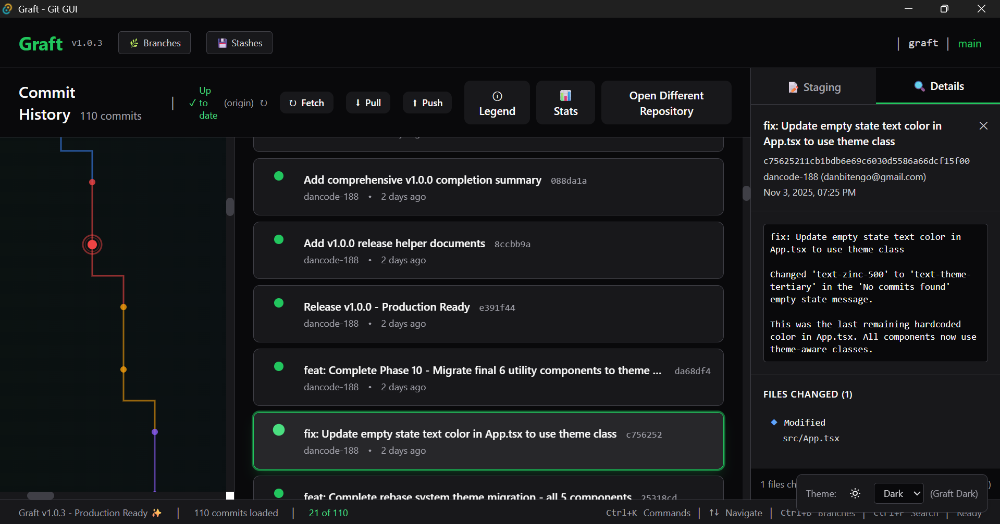
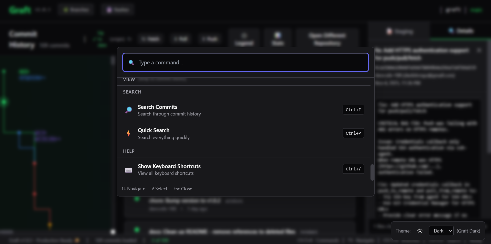
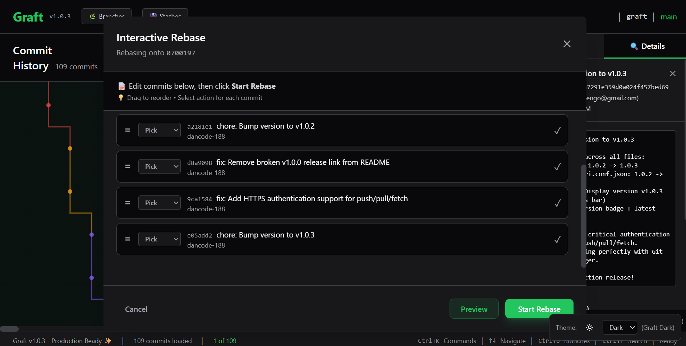

# 🌿 Graft

> A fast, beautiful, keyboard-first Git GUI that doesn't suck.


---

## 🎯 Vision

Graft is a modern Git GUI built with **native performance** (Tauri + Rust), **beautiful design** (React + Tailwind), and a **keyboard-first** approach. It's everything existing Git GUIs should be but aren't.

### Why Graft?
- 😵 **Too complex** (overwhelming interfaces)
- 💸 **Too expensive** (subscription models)
- 🔒 **Too limited** (missing features)
- 🖱️ **Mouse-heavy** (no keyboard shortcuts)

**Graft solves all of this.**

---

## 📸 Screenshots

### Main Interface

*Beautiful commit history with visual graph, commit details, and clean dark theme*

### Command Palette

*Access 30+ Git operations instantly with Ctrl+K*

### Interactive Rebase


---

## 🎬 Demo Videos & Animated GIFs

### Quick Tour (Animated GIF)

*A fast walkthrough of the main UI, commit graph, and keyboard features.*

### Interactive Rebase Demo (GIF)

*See drag-and-drop rebase in action!*

> **Want to contribute?**
> - Record a short GIF (under 10MB) showing a feature or workflow and add it to the `screenshots/` folder.
> - Or upload a demo video to YouTube and submit a PR with the link!

---

## ✨ Features

### 🎨 Core Features (Phases 0-8)

- ✅ **Lightning Fast** - Native Tauri app, sub-second startup
- ✅ **Beautiful Themes** - Professional dark & clean light themes with instant switching
- ✅ **Repository Browser** - Open and browse any Git repository
- ✅ **Commit History** - Beautiful commit graph with 10,000+ commit support
- ✅ **Visual Git Graph** - Color-coded branch visualization
- ✅ **Staging Area** - Stage, unstage, and commit files with ease
- ✅ **Diff Viewer** - Monaco Editor with syntax highlighting
- ✅ **Branch Management** - Create, switch, rename, delete branches
- ✅ **Remote Operations** - Push, pull, fetch with SSH support
- ✅ **Interactive Rebase** - Drag-and-drop commit reordering
- ✅ **Stash Management** - Save and restore work-in-progress
- ✅ **Git Tags** - View and manage repository tags

### ⚡ Keyboard & Speed Features (Phase 9)

- ✅ **Command Palette** (`Cmd/Ctrl+K`) - Access 30+ commands instantly
- ✅ **Quick Search** (`Cmd/Ctrl+P`) - Search commits, branches, stashes
- ✅ **Keyboard Shortcuts** - 20+ global shortcuts for power users
- ✅ **Shortcuts Overlay** (`Cmd/Ctrl+/`) - Learn shortcuts easily
- ✅ **Context Menus** - Right-click actions everywhere
- ✅ **Recent Commands** - Smart tracking of your most-used actions
- ✅ **Performance Optimized** - Debounced search, minimal re-renders
- ✅ **Accessibility** - Full ARIA support for screen readers

### 🎨 Polish & Themes (Phase 10) - NEW IN v1.0.0! ⭐

- ✅ **Complete Theme System** - Professional dark & clean light themes
- ✅ **Instant Theme Switching** - <100ms transition time
- ✅ **System Theme Detection** - Auto-follows OS preference
- ✅ **100% Theme Coverage** - All 34 components themed
- ✅ **Zero Hardcoded Colors** - Clean, maintainable codebase
- ✅ **WCAG AA Accessibility** - High contrast in both themes
- ✅ **Smooth Animations** - 60fps theme transitions
- ✅ **Persistent Preferences** - Your theme choice is saved

---

## 🎮 Keyboard Shortcuts

### General
| Shortcut | Action |
|----------|--------|
| `Cmd/Ctrl+K` | Open command palette |
| `Cmd/Ctrl+P` | Quick search (commits, branches, stashes) |
| `Cmd/Ctrl+O` | Open repository |
| `Cmd/Ctrl+/` | Show keyboard shortcuts |

---


### Accessibility
Accessibility features (screen reader support, keyboard navigation, focus indicators, high contrast) are always enabled.

#### Enabling Windows Narrator (Screen Reader)

You can enable the built-in Windows Narrator screen reader at any time:

- **From the Command Palette:**
  - Open the Command Palette (`Cmd/Ctrl+K`)
  - Type "Enable Windows Narrator" and select the command
  - Follow the instructions in the alert
- **Or use the keyboard shortcut:**
  - Press **Ctrl + Windows + Enter**

This will start the Windows Narrator, which will announce controls and navigation in the app.

| Key/Command      | Action/Behavior                                              |
|------------------|-------------------------------------------------------------|
| Tab / Shift+Tab  | Move focus forward/backward between interactive elements    |
| Enter / Space    | Activate the focused button, toggle, or select an option    |
| Arrow Keys       | Navigate within dropdowns, lists, or menus                  |
| Escape           | Close modals or dialogs                                     |
| Screen Reader    | Announces ARIA labels, roles, and states for all controls   |

No special shortcut is needed—accessibility is built in by default for all users.
| `Escape` | Close modals |

### Navigation
| Shortcut | Action |
|----------|--------|
| `Cmd/Ctrl+F` | Search commits |
| `Cmd/Ctrl+B` | Toggle branch sidebar |
| `Cmd/Ctrl+Shift+S` | Toggle stash sidebar |
| `Arrow Keys` | Navigate lists |
| `Enter` | View selected item |

### Staging & Commits
| Shortcut | Action |
|----------|--------|
| `Space` | Stage/unstage file |
| `Cmd/Ctrl+Enter` | Commit changes |

### Branches
| Shortcut | Action |
|----------|--------|
| `Cmd/Ctrl+N` | Create new branch |

---


## 🏆 Why Graft is Better

### vs GitKraken
- ✅ **Free** (GitKraken: $99/year)
- ✅ **Native** (GitKraken: Electron bloat)
- ✅ **Faster** command palette
- ✅ **Open source**

### vs Tower
- ✅ **Free** (Tower: $99 one-time)
- ✅ **Has command palette** (Tower: doesn't)
- ✅ **Better keyboard shortcuts**
- ✅ **Open source**

### vs Sublime Merge
- ✅ **Free** (Sublime Merge: $99)
- ✅ **More features**
### vs GitHub Desktop
- ✅ **Pro features** (Interactive rebase, stash, etc.)
- ✅ **Command palette**
- ✅ **Comprehensive keyboard shortcuts**
- ✅ **Context menus**

**Result**: Graft has the best keyboard experience of any Git GUI, and it's completely free!

---

## 📥 Installation

### Download Graft

**Latest Release**: [v1.0.5](https://github.com/kernferm/graft)

#### Windows
1. Download one of the installers:
   - **Recommended**: `Graft_1.0.1_x64-setup.exe` (NSIS installer)
   - **Alternative**: `Graft_1.0.1_x64_en-US.msi` (MSI installer)

2. Run the installer

3. **Windows SmartScreen Warning** ⚠️
   
   You may see a "Windows protected your PC" warning. This is normal for open-source applications that don't have a paid code-signing certificate ($300-500/year).
   
   **Graft is completely safe** - the code is open source and auditable.

## 📁 Project Structure

```
   **To install**:
   - Click **"More info"**
   - Click **"Run anyway"**
   
   This warning appears for most open-source Windows apps, including early versions of VS Code and many other trusted tools.

4. Launch Graft from Start Menu


#### macOS
Building from source is currently required (see Development Setup below).

#### Linux
Graft can be installed and run on most major Linux distributions. Pre-built packages and manual installation instructions are provided below.
├── all-tests/                   # Centralized re-exports for all test files
│   ├── CommitGraph.test.tsx
│   ├── CommitListWithGraph.test.tsx
│   ├── RecentReposList.test.tsx
│   ├── ThemeToggle.test.tsx
│   ├── StagingArea.basic.test.tsx
│   ├── StagingArea.test.tsx
│   ├── QuickSearch.test.tsx
│   └── graphLayout.performance.test.ts

**Tested on:**
- Ubuntu 22.04 / 24.04
- Arch Linux
- Fedora
- Debian
- Pop!_OS

**Install via Package:**

**Ubuntu/Debian:**
```bash
# Download .deb from releases
sudo dpkg -i graft_1.0.1_amd64.deb
```

---

## 🧪 Test Organization

All test files are now re-exported in the `all-tests/` directory at the project root. This allows you to run or manage all tests from a single location, while keeping the original test code in their respective feature folders. Update your test runner configuration if you want to run all tests via `all-tests/`.
```

**Arch Linux:**
```bash
yay -S graft-bin
```

**Fedora:**
```bash
# Download .rpm from releases
sudo dnf install graft-1.0.1.x86_64.rpm
```

**Manual Build:**
See Development Setup below for building from source on any Linux distribution.

**Dependencies:**
- GTK 3
- WebKit2GTK
- libssl
- libayatana-appindicator3
- librsvg2

**Known Issues:**
- Some distributions may require additional permissions for SSH key access.
- Display or rendering issues may occur on non-GTK desktops.
- If you encounter missing dependencies, install them as shown in the Development Setup section.

**Help Wanted:**
If you use Linux, please test Graft on your distribution and report any issues or missing dependencies!

---

## 🚀 Getting Started

### Quick Start (After Installation)

1. Launch Graft
2. Press `Ctrl+O` (or click "Open Repository") to select a Git repository
3. Explore your commit history!
4. Press `Ctrl+K` to open the command palette
5. Press `Ctrl+/` to see all keyboard shortcuts

### Building from Source

#### Prerequisites

Before building Graft, ensure you have:

- **Node.js** (v18 or higher) - [Download](https://nodejs.org/)
- **Rust** (latest stable) - [Install via rustup](https://rustup.rs/)
- **Git** (obviously 😄)

#### Platform-Specific Requirements

**macOS:**
- Xcode Command Line Tools: `xcode-select --install`

**Windows:**
- Microsoft C++ Build Tools
- WebView2 (usually pre-installed on Windows 10/11)

**Linux:**
```bash
# Debian/Ubuntu
sudo apt install libwebkit2gtk-4.1-dev \
  build-essential \
  curl \
  wget \
  file \
  libssl-dev \
  libgtk-3-dev \
  libayatana-appindicator3-dev \
  librsvg2-dev

# Fedora
sudo dnf install webkit2gtk4.1-devel \
  openssl-devel \
  curl \
  wget \
  file \
  libappindicator-gtk3-devel \
  librsvg2-devel

# Arch
sudo pacman -S webkit2gtk \
  base-devel \
  curl \
  wget \
  file \
  openssl \
  appmenu-gtk-module \
  gtk3 \
  libappindicator-gtk3 \
  librsvg
```

---

## 🛠️ Development Setup

### 1. Clone the Repository
```bash
git clone https://github.com/Dancode-188/graft.git
cd graft
```

### 2. Install Dependencies
```bash
npm install
```

### 3. Run Development Server
```bash
npm run tauri:dev
```

This will:
- Start the Vite dev server (frontend)
- Compile the Rust backend
- Launch the Graft window with hot reload enabled

### 4. Build for Production
```bash
npm run tauri:build
```

The compiled app will be in `src-tauri/target/release/bundle/`

---


## 📦 Available Scripts

| Command | Description |
|---------|-------------|
| `npm run dev` | Start Vite dev server (frontend only) |
| `npm run tauri:dev` | Run full Tauri app in development mode |
| `npm run tauri:build` | Build production-ready app |
| `npm run build` | Build frontend only |

---

## 🎨 Tech Stack

- **Frontend:** React 18 + TypeScript + Tailwind CSS
- **Backend:** Rust + Tauri 2.0
- **Git Integration:** libgit2 (via git2-rs)
- **Build Tool:** Vite
- **Editor:** Monaco Editor (for diffs)
- **UI Components:** Custom (no heavy framework)

---

## 📂 Project Structure

```
graft/
├── src/                          # Frontend React code
│   ├── App.tsx                   # Main application component
│   ├── main.tsx                  # React entry point
│   ├── components/
│   │   ├── command-palette/      # Command palette (Cmd+K)
│   │   ├── keyboard/             # Keyboard shortcuts system
│   │   ├── quick-search/         # Quick search (Cmd+P)
│   │   ├── stash/                # Stash management
│   │   ├── branches/             # Branch operations
│   │   └── ...                   # Other components
│   ├── hooks/                    # Custom React hooks
│   ├── utils/                    # Utility functions
│   └── styles.css                # Global styles + Tailwind
├── src-tauri/                    # Rust backend
│   ├── src/
│   │   ├── main.rs               # Tauri app entry
│   │   └── lib.rs                # Git operations & commands
│   ├── Cargo.toml                # Rust dependencies
│   └── tauri.conf.json           # Tauri configuration
├── .github/                      # GitHub templates
│   ├── ISSUE_TEMPLATE/           # Bug & feature templates
│   └── PULL_REQUEST_TEMPLATE.md  # PR template
├── ROADMAP.md                    # Development phases & roadmap
├── CONTRIBUTING.md               # Contribution guidelines
├── CODE_OF_CONDUCT.md            # Community standards
├── CHANGELOG.md                  # Version history
└── package.json                  # Node dependencies
```

---

## 🗺️ Roadmap

### Completed Phases ✅

- **Phase 0: Foundation** - Project setup, basic UI
- **Phase 1: Repository Browser** - Open and browse repos
- **Phase 2: Commit Graph** - Beautiful visual history
- **Phase 3: Staging & Commits** - Make commits through GUI
- **Phase 4: Diff Viewer** - Monaco Editor with syntax highlighting
- **Phase 5: Branching** - Branch operations
- **Phase 6: Push/Pull/Fetch** - Remote operations
- **Phase 7: Interactive Rebase** - Drag-and-drop reordering
- **Phase 8: Stash Management** - Save and restore WIP
- **Phase 9: Keyboard & Speed** - Command palette, shortcuts, performance ⭐
- **Phase 10: Polish & Themes** - Complete light/dark theme system ⭐

### 🚀 v1.0.0 - Production Ready!

Graft is now **production-ready** with all 10 planned phases complete! 🎉

**What's Next?**
- Multi-repo workspaces
- Cherry-pick improvements
- Visual merge conflict resolution
- Git blame annotations
- Submodule support

See [ROADMAP.md](./docs/ROADMAP.md) for complete details.

---


## 📈 Performance

Graft is designed for speed:

- **Startup**: <1 second
- **Large Repos**: Handles 10,000+ commits smoothly
- **Commit Graph Layout**: 10,000 commits laid out in just **16ms** (benchmarked)
- **Command Palette**: Opens in <50ms
- **Search**: Updates in <100ms
- **Virtual Scrolling**: Smooth with thousands of items
- **Memory**: Efficient with memoization and optimization

---

## ♿ Accessibility

Graft is fully accessible:

- ✅ **Screen Reader Support** - Full ARIA labels
- ✅ **Keyboard Navigation** - 95% of actions accessible via keyboard
- ✅ **High Contrast** - Clear visual hierarchy
- ✅ **Focus Management** - Proper focus indicators

---


## 🤝 Contributing

Graft is in active development! We welcome contributions.

### How to Contribute

1. **Fork the repository**
2. **Create a feature branch**: `git checkout -b feature/amazing-feature`
3. **Commit your changes**: `git commit -m 'Add amazing feature'`
4. **Push to the branch**: `git push origin feature/amazing-feature`
5. **Open a Pull Request**

### Development Guidelines

- Follow existing code style
- Add tests for new features
- Update documentation
- Keep commits focused and atomic
- Write clear commit messages

---

## 🐛 Known Issues

All issues have been applied and fixed on the BubblesTheDev GRAFT repo with version 1.0.5. Note: dancode-188 may not have updated his repo yet. For any new issues, check [GitHub Issues](https://github.com/Dancode-188/graft/issues).

---

## 📄 License

MIT License - see [LICENSE](./LICENSE) file for details

---

## 💬 Inspiration

Graft is inspired by:
- **VS Code** - Command palette design
- **Sublime Merge** - Speed and keyboard-first design
- **GitKraken** - Beautiful commit graphs
- **Raycast** - Beautiful launcher UX
- **Vim** - Keyboard-first philosophy

We're taking the best ideas and making them free, fast, and open source.

---

## 🌟 Show Your Support

If you like Graft, give it a ⭐ on GitHub!

### Stay Updated

- 🌟 Star the repo
- 👁️ Watch for releases
- 🐦 Follow development updates
- 💬 Join discussions

---

## 📚 Documentation

- [ROADMAP.md](./docs/ROADMAP.md) - Development roadmap and future plans
- [CONTRIBUTING.md](./docs/CONTRIBUTING.md) - How to contribute to Graft
- [CODE_OF_CONDUCT.md](./docs/CODE_OF_CONDUCT.md) - Community guidelines
- [CHANGELOG.md](./docs/CHANGELOG.md) - Full version history
- [GitHub Releases](https://github.com/Dancode-188/graft/releases) - Release notes

---

## 🎉 Recent Releases

### v1.0.5 - Authentication Fix (November 6, 2025) 🎊 LATEST

**Critical Patch**: Fixed Push/Pull Authentication

- 🔐 Fixed HTTPS authentication for push/pull/fetch operations
- ✅ Added support for Git Credential Manager
- 🐛 Resolved 401 errors on HTTPS remotes
- 🔑 Now works with both SSH and HTTPS authentication
- ⚡ Push functionality fully working

[View on GitHub Releases](https://github.com/Dancode-188/graft/releases/tag/v1.0.5)

### v1.0.2 - Clean & Ready (November 4, 2025)

**Patch Release**: Repository Cleanup & Polish

- 🧹 Cleaned up 65+ internal development files
- 📚 Added comprehensive contributor documentation
- 🤝 Added GitHub issue & PR templates
- 👥 Added CODE_OF_CONDUCT & CONTRIBUTING guides
- 🐛 Fixed all README links to correct repository

[View on GitHub Releases](https://github.com/Dancode-188/graft/releases/tag/v1.0.2)

### v1.0.1 - Bug Fixes & Documentation (November 4, 2025)

**Patch Release**: Polish & Documentation

- 🐛 Fixed version display and status bar bugs
- 📚 Added comprehensive installation guide
- 🔧 Added troubleshooting section for common issues
- ✨ Improved Windows SmartScreen instructions
- 🔑 Added SSH/HTTPS authentication setup guide

[View on GitHub Releases](https://github.com/Dancode-188/graft/releases/tag/v1.0.1)

### Previous Major Features

**v1.0.0 (November 3, 2025)** - Production Ready!
- Complete theme system (dark & light)
- 100% theme coverage across all components
- Instant theme switching
- WCAG AA accessibility

**Earlier Releases:**
- **v0.9.0** - Keyboard & Speed (Command palette, shortcuts, performance)
- **v0.8.0** - Stash Management
- **v0.7.0** - Interactive Rebase
- **v0.6.0** - Push/Pull/Fetch
- **v0.5.0** - Branch Operations

**See all releases**: [GitHub Releases](https://github.com/Dancode-188/graft/releases)

---

## 🎯 Project Status

| Feature | Status |
|---------|--------|
| Core Git Operations | ✅ Complete |
| Commit History | ✅ Complete |
| Visual Graph | ✅ Complete |
| Staging & Commits | ✅ Complete |
| Diff Viewer | ✅ Complete |
| Branch Management | ✅ Complete |
| Remote Operations | ✅ Complete |
| Interactive Rebase | ✅ Complete |
| Stash Management | ✅ Complete |
| Command Palette | ✅ Complete |
| Keyboard Shortcuts | ✅ Complete |
| Quick Search | ✅ Complete |
| Context Menus | ✅ Complete |
| Performance | ✅ Optimized |
| Accessibility | ✅ Complete |
| Light Theme | ✅ Complete |
| Dark Theme | ✅ Complete |
| Theme System | ✅ Complete |
| v1.0.0 Status | ✅ Production Ready |

---

## 🔧 Troubleshooting

### Windows SmartScreen Warning

**Issue**: "Windows protected your PC" warning appears when installing.

**Solution**: This is expected for unsigned apps.
1. Click **"More info"**
2. Click **"Run anyway"**

**Why this happens**: Graft is not code-signed (certificates cost $300-500/year). This is normal for open-source software. The code is completely safe and auditable on GitHub.

---

### Push/Pull Authentication

**Issue**: Push or Pull operations fail with authentication errors.

**Solution**: Configure your Git credentials for remote operations.

#### For SSH (Recommended):
```bash
# 1. Generate SSH key (if you don't have one)
ssh-keygen -t ed25519 -C "your_email@example.com"

# 2. Add to ssh-agent
eval "$(ssh-agent -s)"
ssh-add ~/.ssh/id_ed25519

# 3. Add public key to GitHub/GitLab
cat ~/.ssh/id_ed25519.pub
# Copy and paste to GitHub Settings → SSH Keys
```

#### For HTTPS:
```bash
# Configure Git credential helper
git config --global credential.helper store
# Next push/pull will ask for credentials once
```

After configuring credentials once, Graft will use your system's Git configuration for all operations.

---

### Can't Open Repository

**Issue**: "Failed to open repository" error.

**Solutions**:
- Ensure the selected folder is a valid Git repository (contains `.git` folder)
- Check you have read permissions for the directory
- Try closing and reopening Graft
- Check the repository isn't corrupted: `git status` in terminal

---

### Performance Issues

**Issue**: Slow performance with large repositories.

**Solutions**:
- Graft handles 10,000+ commits smoothly
- If experiencing slowness, check available RAM
- Try closing other resource-intensive applications
- Consider using `git gc` to optimize your repository

---

### Need More Help?

- 🐛 **Report bugs**: [GitHub Issues](https://github.com/Dancode-188/graft/issues)
- 💬 **Get help**: [GitHub Discussions](https://github.com/Dancode-188/graft/discussions)
- 📖 **Documentation**: [Full docs](./docs/README.md)

---

## 💡 Quick Start Guide

### First Time Users

1. **Open Graft** and press `Cmd+O` to open a repository
2. **Browse commits** with arrow keys
3. **Try command palette** with `Cmd+K`
4. **Search everything** with `Cmd+P`
5. **Learn shortcuts** with `Cmd+/`
6. **Right-click** on commits, stashes, or files for actions

### Power Users

Graft is built for you! Here's how to be 10x faster:

- Use `Cmd+K` instead of clicking menus
- Master the shortcuts with `Cmd+/`
- Search with `Cmd+P` instead of scrolling
- Right-click for quick actions
- Use `Space` to stage/unstage files
- Never touch your mouse 😎

---

**Built with 🌿 by developers who are tired of bad Git GUIs**

*Graft: The Git GUI that power users actually want to use.* ⚡
